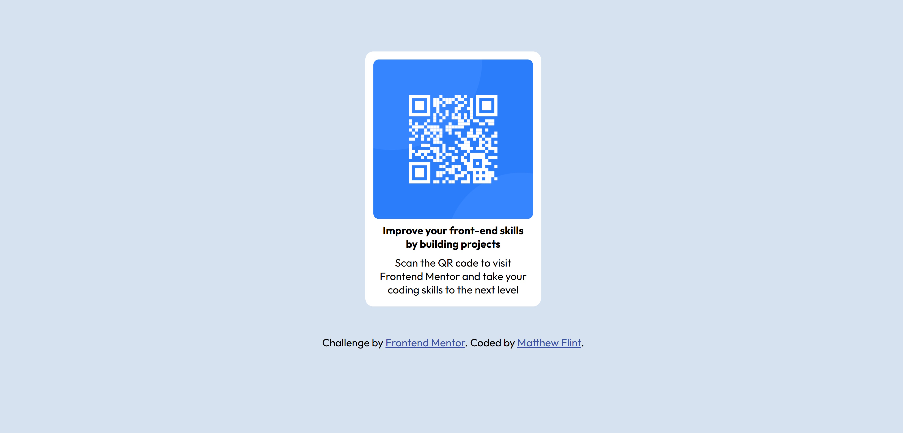

# Frontend Mentor - QR code component solution

This is a solution to the [QR code component challenge on Frontend Mentor](https://www.frontendmentor.io/challenges/qr-code-component-iux_sIO_H). Frontend Mentor challenges help you improve your coding skills by building realistic projects. 

## Table of contents

- [Overview](#overview)
  - [Screenshot](#screenshot)
  - [Links](#links)
- [My process](#my-process)
  - [Built with](#built-with)
  - [What I learned](#what-i-learned)
  - [Continued development](#continued-development)
- [Author](#author)


## Overview

I built my first project for Frontend Mentor - A QR Component. After some initial struggles to start the structure, it was a relatively straightforward design to piece together. This README describes my process and what I learned, as well as links to the finished project and notes on what to improve.

### Screenshot




### Links

- Solution URL: [Add solution URL here](https://your-solution-url.com)
- Live Site URL: [Add live site URL here](https://your-live-site-url.com)

## My process

### Built with

- Semantic HTML5 markup
- CSS custom properties

### What I learned

My initial takeaway was that I developed perserverence in the face of initial confusion. I started by staring blankly at the brief and worrying that I wouldn't be able to even start, but my analytical side kicked in and 
I trusted that I knew the concepts, which led to me eventually piecing the structure together. I also had to
become comfortable with imperfection. I'm happy with the result but I also know that there is room for improvement and that's a better place to be than not building the project out of fear that it won't be perfect.

I learned to experiment with different ways of achieving the same visual result on the page. I initially 
displayed the card with flexbox like this:

```css
#qr-card {
  display: flex;
  justify-content: center;
  align-items: center;
  flex-direction: column;
}
```
But then I discovered it wasn't necessary and could just center the margin of the card with some additional spacing on the top and bottom:

```css
#qr-card {
  margin: 100px auto 50px;
}
```
The biggest takeaway was that I don't need to use more complex techniques all the time - simplicity is best especially for something as small as this. 


### Continued development

I'm quite sure that there is probably a better way to get the main card more central than the margin code I have in my CSS. I can imagine that it isn't ideal for when the design needs to be more responsive, so that's something I would need to seek further insight on. 


## Author

- Website - [Matthew Flint](https://matthew-flint.github.io/QR-Code-Component/)
- Frontend Mentor - [@Matthew-Flint](https://www.frontendmentor.io/profile/Matthew-Flint)


